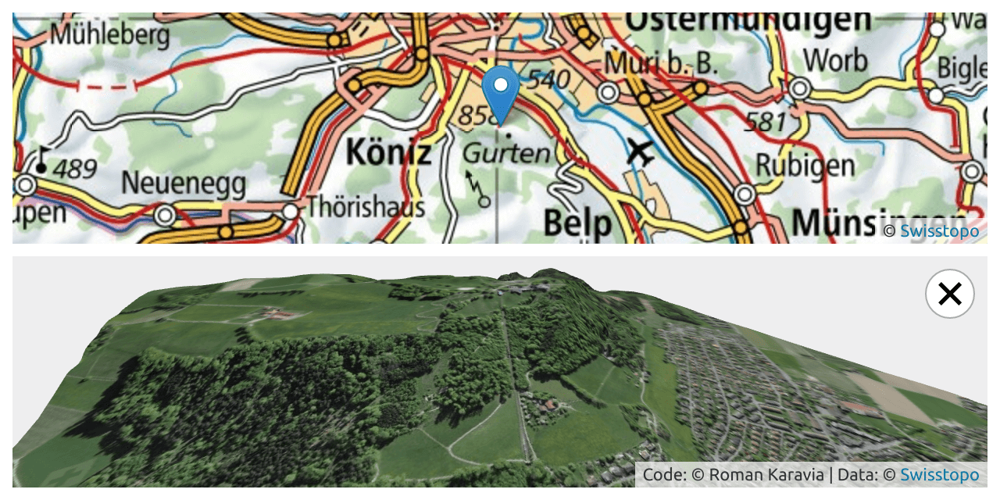

# MeshTiler CH

Get a 3D mesh of any place in Switzerland using data from Swisstopo, based on
[swissALTI3D](https://www.swisstopo.admin.ch/en/geodata/height/alti3d.html) elevation data and
[SWISSIMAGE](https://www.swisstopo.admin.ch/en/geodata/images/ortho/swissimage10.html) aerial imagery.

Demo: **[Try it here!](https://labs.karavia.ch/mesh-tiler-ch/)**

[](https://labs.karavia.ch/mesh-tiler-ch/)

See also: [MeshTiler](https://github.com/rkaravia/MeshTiler) – similar project with worldwide coverage

## Install

```
npm install
```

## Run

```
npm run dev
```

## License

This project is licensed under the MPL 2.0 license, see the LICENSE file.

## Acknowledgements

The following open source libraries have made MeshTiler possible:

- [MARTINI](https://github.com/mapbox/martini), © 2019 Mapbox,
  [ISC License](https://github.com/mapbox/martini/blob/master/LICENSE)
- [Svelte](https://svelte.dev), © 2016-2021 Svelte contributors
  [MIT License](https://github.com/sveltejs/svelte/blob/master/LICENSE)
- [Leaflet](https://leafletjs.com), © 2010-2011 CloudMade, © 2010-2021 Vladimir Agafonkin,
  [BSD 2-Clause License](https://github.com/Leaflet/Leaflet/blob/master/LICENSE)
- [three.js](https://threejs.org), © 2010-2021 three.js authors,
  [MIT License](https://github.com/mrdoob/three.js/blob/master/LICENSE)
